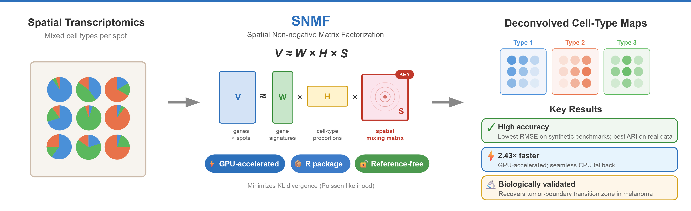

# SNMF (Spatial Non-Negative Matrix Factorization)

<p align="center">
  
</p>

**SNMF (Spatial Non-negative Matrix Factorization)** is a rapid, accurate, and reference-free deconvolution method for sequencing-based spatial transcriptomics data. It extends classical NMF with explicit spatial modeling and is the first spatial transcriptomics deconvolution tool to natively support GPU acceleration, while providing a seamless CPU fallback.

This repository contains the official implementation accompanying the paper:

> **SNMF: Ultrafast, Spatially-Aware Deconvolution for Spatial Transcriptomics**

## Installation

This repository contains the package of SNMF, wich can be installed by running:
```R
devtools::install_github("LuisAlonsoEsteban/SNMF")
```

Before installing **SNMF**, make sure that the **GPUmatrix** package is installed and working on your system. See the [installation instructions](https://github.com/ceslobfer/GPUmatrix?tab=readme-ov-file#0-installation)

## Usage

Load the SNMF package:

```R
library(SNMF)
```

This package provides with a toy example of the **Triple Negative Breast Cancer (TNBC)** dataset, with the 100th most variable genes. You can load it with:

```R
data(tnbc)
```

which saves this *data.frame* in a variable called *tnbc*.

Next, you can preprocess this matrix and generate the $S$ matrix with the following function:

```R
data <- load_data(tnbc)
counts <- data$counts
S <- data$S
```

Finally, you can run SNMF:

```R
results <- snmf(counts, S, 5, niter=2000, tol=1e-4, num_initializations=10, probs=0.75, seed=42)
H <- results$H
W <- results$W
```