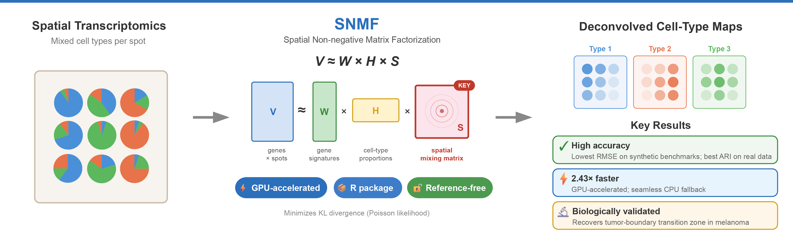

# SNMF (Spatial Non-Negative Matrix Factorization)

<p align="center">
  
</p>

**SNMF (Spatial Non-negative Matrix Factorization)** is a rapid, accurate, and reference-free deconvolution method for sequencing-based spatial transcriptomics data. It extends classical NMF with explicit spatial modeling and is the first spatial transcriptomics deconvolution tool to natively support GPU acceleration, while providing a seamless CPU fallback.

This repository contains the official implementation accompanying the paper:

> **SNMF: Ultrafast, Spatially-Aware Deconvolution for Spatial Transcriptomics**

## Installation

Install SNMF from GitHub:

```r
install.packages("remotes") # If not already installed
remotes::install_github("LuisAlonsoEsteban/SNMF")
```

GPUmatrix is installed automatically as an R package dependency. To run SNMF,
configure **one** of its tensor backends: **torch** (the default) or
**TensorFlow**. Both R packages are available on CRAN; their tensor libraries
require the additional setup below.

### Option 1: torch (default)

```r
install.packages("torch")
torch::install_torch() # If the tensor libraries were not installed automatically
```

Follow the [torch installation guide](https://torch.mlverse.org/docs/articles/installation.html)
for your operating system and CPU or GPU build. CUDA and cuDNN requirements depend
on the torch version; supported prebuilt GPU binaries can include these libraries.

Check whether torch can use CUDA:

```r
torch::cuda_is_available()
```

With the torch backend, GPUmatrix automatically selects CUDA when available and
otherwise uses the CPU. SNMF defaults to torch; to select it explicitly, run this
before calling `snmf()`:

```r
options(typeTensor = "torch")
```

### Option 2: TensorFlow

TensorFlow requires a compatible Python 3 installation in addition to the R
package. Follow the [TensorFlow for R installation guide](https://tensorflow.rstudio.com/install/)
for Python setup and platform-specific instructions.

```r
install.packages("tensorflow")
# If a compatible Python installation is not already available:
# reticulate::install_python()
tensorflow::install_tensorflow()
```

For a CPU-only installation, use `tensorflow::install_tensorflow(version = "cpu")`
instead. GPU setup depends on your operating system and TensorFlow version; see
the [TensorFlow GPU guide](https://tensorflow.rstudio.com/install/local_gpu.html).

After installation, select TensorFlow in each R session before running `snmf()`:

```r
options(typeTensor = "tensorflow")
```

Check the GPUs visible to TensorFlow:

```r
tensorflow::tf$config$list_physical_devices("GPU")
```

An empty list means TensorFlow is not detecting a GPU. GPUmatrix's TensorFlow
backend relies on TensorFlow's device configuration.

### GPU requirements

For CUDA acceleration, use a [compatible NVIDIA GPU](https://developer.nvidia.com/cuda-gpus)
with a supported NVIDIA driver and the runtime libraries required by your chosen
backend. Follow the backend's installation guide for matching versions of CUDA
and cuDNN. A working CPU backend can run SNMF without a compatible GPU.

## Usage

Load the SNMF package:

```R
library(SNMF)
```

This package provides with a toy example of the **Triple Negative Breast Cancer (TNBC)** dataset, with the 100th most variable genes. You can load it with:

```R
data(tnbc)
```

which saves this *data.frame* in a variable called *tnbc*.

Next, you can preprocess this matrix and generate the $S$ matrix with the following function:

```R
data <- load_data(tnbc)
counts <- data$counts
S <- data$S
```

Finally, you can run SNMF:

```R
results <- snmf(counts, S, 5, niter=2000, tol=1e-4, num_initializations=10, probs=0.75, seed=42)
H <- results$H
W <- results$W
```

For further questions or to report a problem, please [open an issue on GitHub](https://github.com/LuisAlonsoEsteban/SNMF/issues/new). 

## Contact

Luis Alonso Esteban — [laesteban@unav.es](mailto:laesteban@unav.es)
